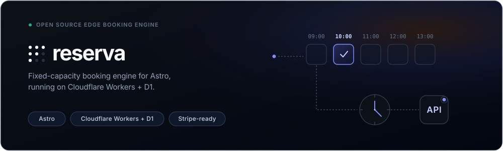

# Reserva

**A booking engine for fixed-capacity time slots, built as an Astro integration. It runs in
your own Cloudflare account on Workers + D1, with no per-booking fees.**

Add Reserva to an Astro 7 site and it mounts a booking API, the confirmation and manage pages,
and an admin dashboard, all backed by your own D1 database. It runs on the Workers Free plan;
[Which Workers plan](./docs/deployment.md#which-workers-plan) covers what Paid changes.

Reserva handles availability, holds, payment checks, cancellations and reschedules, refunds,
calendar and email delivery, retries, partners and referral codes, and the admin. You build the
customer-facing booking form yourself, on the public API.

## What it books

Fixed-length slots with a shared capacity: hold, pay, confirm, then cancel or reschedule within
cutoffs. That fits tours, classes, workshops, restaurant tables, court and room hire,
general-admission events, and appointments with interchangeable staff.
[`examples/configs/`](./examples/configs) has complete configs for several of these. All
services share one capacity pool.

It doesn't do:

- Multi-day or date-range rentals.
- Assigned seating, where each seat is its own unit.
- Scheduling per staff member.
- A booking widget. [`examples/smoke-site`](./examples/smoke-site) has a complete one to copy.

## Quickstart

```sh
bun add @reservajs/astro
bun add @reservajs/stripe   # the official payment adapter
```

```ts
// reserva.config.ts — plain data, shared by the integration and the runtime module
import type { ClientConfig } from '@reservajs/astro';

export default {
  business: {
    name: 'Lisbon Tuk Tours', shortCode: 'LTT', url: 'https://lisbontuktours.example',
    timezone: 'Europe/Lisbon', currency: 'eur',
    contact: { email: 'bookings@lisbontuktours.example', phone: '+351 210 000 000' },
  },
  capacity: { default: 3 },              // tuk-tuks per departure
  admin: { access: { teamDomain: 'https://lisbontuktours.cloudflareaccess.com', aud: '<AUD>' } },
  services: {
    alfama: {
      title: 'Alfama Discovery', durationMin: 60, turnaroundMin: 15,
      schedule: [{ days: [1, 2, 3, 4, 5, 6], firstStart: '09:00', lastStart: '17:00', intervalMin: 60 }],
      occupancy: { seatsPerUnit: 3 },    // one tuk-tuk seats a party of up to 3
      pricing: [{ maxQuantity: 3, priceMinor: 4500 }],
      location: {
        meetingPoints: [{ id: 'se', label: 'Sé Cathedral', mapsUrl: 'https://maps.google.com/?q=Se+Lisboa' }],
      },
    },
  },
} satisfies ClientConfig;
```

Everything else has a default. A service with only `meetingPoints` gets one implied pickup
option, so its pricing row needs no `pickup`.
[`docs/configuration.md`](./docs/configuration.md) covers the rest.

```ts
// astro.config.ts
import { defineConfig } from 'astro/config';
import cloudflare from '@astrojs/cloudflare';
import reserva from '@reservajs/astro';
import config from './reserva.config';

export default defineConfig({
  output: 'server',
  adapter: cloudflare(),
  integrations: [reserva({ config })],
});
```

```ts
// src/reserva-runtime.ts — the only place provider instances and secrets exist
import { defineCloudflareReservaRuntime } from '@reservajs/astro/runtime';
import { stripe } from '@reservajs/stripe';

// `Env` is global, generated by `wrangler types` — no import. The booking config is not imported
// either: the integration already validated it and hands it over through `virtual:reserva/config`.
export default defineCloudflareReservaRuntime<Env>({
  providers: ({ env }) => ({
    payments: stripe({ secretKey: env.STRIPE_SECRET_KEY, webhookSecret: env.STRIPE_WEBHOOK_SECRET }),
  }),
});
```

Declare the D1 binding and apply the migrations:

```jsonc
// wrangler.jsonc
{
  "name": "lisbon-tuk-tours",
  "compatibility_date": "2026-07-21",
  "d1_databases": [
    { "binding": "RESERVA_DB", "database_name": "reserva", "database_id": "<wrangler d1 create reserva>" }
  ]
}
```

```sh
bunx reserva-migrate --local   # local dev database
bunx reserva-migrate           # remote
```

That's a working deployment. `output: 'static'` works too: the injected routes set
`prerender: false`, so they render on demand.

## The runtime module

Astro serializes integration options at build time, and provider instances (clients, closures,
secrets) can't be serialized. So the config travels to the runtime through
`virtual:reserva/config`, and your runtime module is loaded per request through
`virtual:reserva/runtime`. The default path is `./src/reserva-runtime.ts`; pass
`runtimeEntrypoint` only if yours is elsewhere.

Bindings come from `cloudflare:workers`. Don't read `locals.runtime.env`: it throws on
`@astrojs/cloudflare` v14. The default D1 binding is `RESERVA_DB`, and the cache is
`RESERVA_CACHE` with a fallback to `caches.default`.

Keep secrets (payment keys, service-account keys, webhook signing keys) out of `ClientConfig`
and out of the repo. Store them as Worker secrets. Reserva reads its own `RESERVA_*` secrets and
each `config.webhooks[].secretBinding` by itself; list in `secretBindings` only the ones your
own code reads.

## Payments

`@reservajs/astro` has no Stripe dependency. Payments go through the `PaymentProvider`
interface: install [`@reservajs/stripe`](./packages/stripe) for Stripe Checkout, or
[write an adapter](./docs/providers.md) for another processor. Reserva always computes the
price; the adapter only charges it.

Point a Stripe webhook at `/api/booking/webhooks/payment` and subscribe it to
`checkout.session.completed`, `checkout.session.expired`,
`checkout.session.async_payment_succeeded`, `checkout.session.async_payment_failed`,
`charge.refunded`, `charge.dispute.created` and `charge.dispute.closed`. Turn payment methods on
in the Stripe dashboard, but leave delayed ones off (Multibanco, SEPA Direct Debit, bank
transfer): their money arrives after the hold expires, so Reserva refuses them.

## Partners and referral codes

Partners (hotels, agents, affiliates) are managed in the admin at `/booking/admin?view=partners`.
Each partner gets a code and a referral link, `<business.url>?ref=<code>`, and can carry an
offer: a percentage off the service price, free pickup, or both. Bookings made with a code show
the partner, the price before the offer and the discount in the admin.

Your site reads `ref`, resolves it with `resolveReferral()`, and passes it as `referralCode` to
`quote()` and `checkout()`. Offers stay off until you enable them in the runtime with a minimum
charge per currency. [Partner offers](./docs/api.md#partner-offers-and-referral-codes) has the
full flow.

## Booking events

Each booking event reaches two kinds of subscriber, both delivered from one durable outbox.
The set is exported as `BOOKING_EVENTS` from `@reservajs/astro/core`:

<!-- generated:booking-events -->
`booking.confirmed`, `booking.cancelled_by_customer`, `booking.cancelled_by_operator`, `booking.rescheduled`, `booking.no_show`, `booking.reminder`, `payment.dispute_created`
<!-- /generated:booking-events -->

**Hooks** run in-process. A plain hook is fire-and-forget; a `durable: true` hook is retried
like any other side effect:

```ts
hooks: [
  { name: 'analytics', handler: async (event, booking) => track(event, booking?.reference) },
  { name: 'ops', durable: true, events: ['booking.confirmed'], handler: pushToOps },
]
```

**Webhooks** go in `config.webhooks`. They're always durable and signed per
[Standard Webhooks](https://www.standardwebhooks.com/):

```ts
webhooks: [{ name: 'partner', url: 'https://partner.example/reserva', secretBinding: 'PARTNER_WEBHOOK_SECRET', events: ['booking.confirmed'] }]
```

A subscriber can also name `settings.changed`, which fires on each admin save so a static site
can rebuild. See [Rebuilding a static site](./docs/deployment.md#rebuilding-a-static-site-on-admin-changes).
The envelope and signature headers are in [`docs/api.md`](./docs/api.md#webhooks).

## Injected routes

All routes are server-rendered. This table is generated from the route manifest:

<!-- generated:routes -->
| Route id | Path | Group |
|---|---|---|
| `availability` | `/api/booking/availability` | customer |
| `checkout` | `/api/booking/checkout` | customer |
| `quote` | `/api/booking/quote` | customer |
| `resolveReferral` | `/api/booking/referral` | customer |
| `catalog` | `/api/booking/catalog` | customer |
| `webhooksPayment` | `/api/booking/webhooks/payment` | webhook |
| `status` | `/api/booking/status` | customer |
| `manageApi` | `/api/booking/manage` | customer |
| `cancel` | `/api/booking/cancel` | customer |
| `reschedule` | `/api/booking/reschedule` | customer |
| `operatorCancel` | `/api/booking/operator/cancel` | ops |
| `operatorReschedule` | `/api/booking/operator/reschedule` | ops |
| `operatorNoShow` | `/api/booking/operator/no-show` | ops |
| `opsHealth` | `/api/booking/ops/health` | ops |
| `reconcile` | `/api/booking/ops/reconcile` | ops |
| `assetsCss` | `/booking/assets/reserva.css` | customer |
| `assetsJs` | `/booking/assets/reserva.js` | customer |
| `adminPage` | `/booking/admin` | admin |
| `managePage` | `/booking/manage` | manage |
| `confirmationPage` | `/booking-confirmation` | customer |
<!-- /generated:routes -->

Request and response types are exported from `@reservajs/astro/core`. Every error is
`{ error: { code, message, details? } }`, with `code` from `API_ERROR_CODES`:

<!-- generated:error-codes -->
`validation_failed`, `method_not_allowed`, `payload_too_large`, `forbidden`, `not_found`, `past_cutoff`, `invalid_transition`, `slot_unavailable`, `too_many_holds`, `quote_changed`, `partner_storage_unavailable`, `partner_conflict`, `payment_session_mismatch`, `payment_amount_mismatch`, `invalid_payment_signature`, `duplicate_payment_ref`, `confirmation_in_progress`, `reconciliation_in_progress`, `refund_conflict`, `refund_payment_ref_missing`, `refund_failed`, `calendar_unavailable`, `internal_error`
<!-- /generated:error-codes -->

## Documentation

- [`docs/configuration.md`](./docs/configuration.md): every config key, pricing, opening hours,
  locations, metadata fields, routes and CORS.
- [`docs/api.md`](./docs/api.md): the endpoints, the typed client, partner offers, webhooks,
  and why some status codes behave the way they do.
- [`docs/deployment.md`](./docs/deployment.md): secrets, admin access, the setup checklist,
  the scheduled sweep, and migrations.
- [`docs/customization.md`](./docs/customization.md): theming, branding, copy, and email
  templates.
- [`docs/providers.md`](./docs/providers.md): writing a payment, calendar, email or alert
  adapter.
- [`docs/development.md`](./docs/development.md): the local demo, tests, and contributing.
- [`docs/architecture.md`](./docs/architecture.md): the system map and the rules a change must
  keep.
- [`docs/decisions.md`](./docs/decisions.md): where Reserva departs from its original spec, and
  why.
- [`AGENTS.md`](./AGENTS.md): the integration contract, written for coding agents.

Security reports: see [`SECURITY.md`](./SECURITY.md).

## License

MIT
